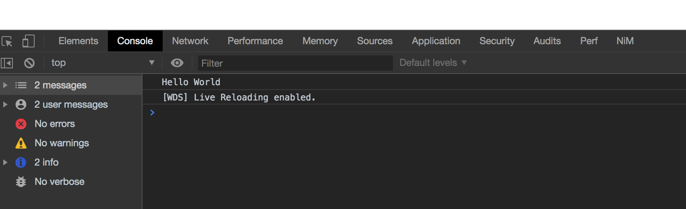

## Build

```
cargo build --target=wasm32-unknown-unknown
```

### Error tips

**error: cannot find attribute `wasm_bindgen` in this scope**

```diff
[package]
+ edition = "2018"

[lib]
```

### wasm-bindgen

```bash
wasm-bindgen target/wasm32-unknown-unknown/debug/wasm_module_with_rust.wasm --out-dir lib
```

### [expand](https://github.com/dtolnay/cargo-expand)

逆コンパイル

```bash
cargo expand --target=wasm32-unknown-unknown > expanded.rs
```

* https://hacks.mozilla.org/2018/04/javascript-to-rust-and-back-again-a-wasm-bindgen-tale/

### webpack build

```
yarn dev
```

Open localhost:8080




## Reference

* https://dev.to/sendilkumarn/rust-and-webassembly-for-the-masses-wasm-bindgen-57fl
